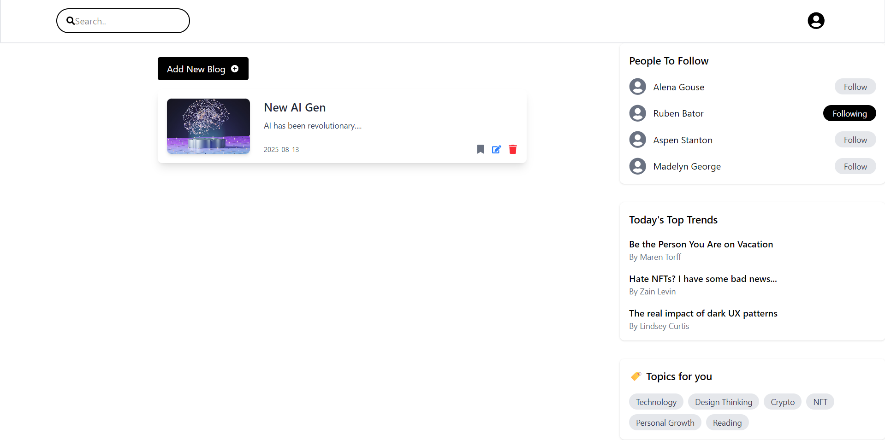

# 📰 Blogs Frontend – React + TypeScript

A **pure frontend React + TypeScript** project that simulates a modern blogging platform.  
Users can browse blogs, search, add new blog entries, follow people, and explore trending topics — all in a clean, responsive UI.



## ✨ Features

- ➕ **Add New Blog** button with modal/form integration
- 📄 **Blog Cards** displaying:
  - Blog image
  - Title & short description
  - Publish date
  - Edit, bookmark, and delete options
- 👥 **People To Follow** section with follow/unfollow state
- 📈 **Today's Top Trends** showcasing trending articles
- 🏷 **Topics For You** tag recommendations
- ⚡ Fully responsive & interactive UI
- 🛡 **TypeScript** for safer, maintainable code

## 🛠 Tech Stack

- **React** (with Functional Components)
- **TypeScript**
- **React Hooks** (`useState`, `useEffect`)
- **Tailwind CSS**
- **React Icons** for UI icons


## 🚀 Getting Started

1. **Clone the Repository**
     ```bash
   git clone https://github.com/your-username/blogs-frontend.git
   cd blogs-frontend
    ```
  ```bash
2. npm install
  ```
```bash
3. npm run dev
```

## 📌 Notes
- This is frontend only — no backend or database is connected
- All data is mock data stored in local state
- Refreshing the page will reset content to defaults

